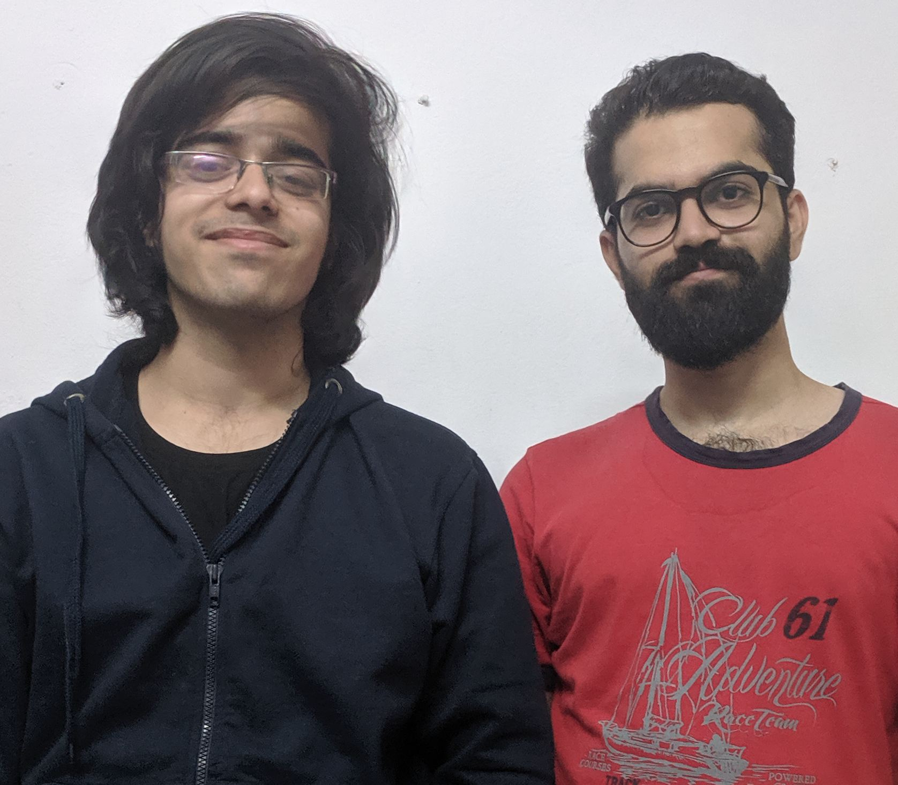

# gpt2-converse

# Screenshot

# Analysis of the game

The game was interesting to all players. People found it engaging and 
entertaining due to the inherent unpredicability of the chatbot. We could have
made the experience much more realsitic if we could have had:

- A larger model for more coherent text, and the ability to retain more of 
  the context of the conversation

- More time to fine-tune the model towards the topics we were interested in.
  Some compute power spent in fine-tuning makes the model output much more
  realistic

There was some divide over the interface. Some people enjoyed the old school
retro inteface of typing into the terminal. Others felt that the experience
would have been much better if we had a GUI. We unfortunately had technical
considerations for why we could not build a GUI: The model that powers the
chat engine runs on the local `ada` servers that block HTTP access. Hence,
we were running the whole game over SSH. However, we can in the future move
the model to google cloud and thereby get some more performance.

Based on the feedback from the players about the realistic nature of responses,
we believe a refined version of the game would be capable of passing the Turing
test. 

##### Results:

The game managed to hold coherent conversations offering appropriate and interesting
responses to queries. In a few instances the responses were irrelevant or repetitive.
The players found the game to be realistic and certain responses very interesting.
They found the challenge of identifying the correct action quite engaging and allowed
for creative questioning that often had funny or unexpected responses. The lack of
restrictions on the kind of questions prompted certain players to test the quality of
responses to more complex questions. Further, many players asked socio-political
questions like "What is your opinion of Trump?" and ethical questions about the game's
views on murder, etc. The answers were sometimes ambiguous in nature giving the
character a realistic feel. 

# [Game design document](./Game-design-document.docx)

# Introduction

Use GPT-2 To try and simulate a conversation between a person and an immigration officer.
Topic chosen due to the fact that GPT-2 appears to be trained on a corpus of text that knows an
unusual amount about wars, famine, death, american politics, and the middle east.

We attempt to prime GPT-2 by setting up the "context" of the person who is being interviewed.
We then append the entire transcript and ask GPT-2 to continue the conversation.

# Team photo

# Installation instructions and links
- clone from: https://github.com/bollu/gde-game
- setup GPT-2 by calling `git submodule update --init`
- install GPT-2  as per the GPT-2 instructions
- setup dependences with `pip install -r requirements.txt --user`
- run `game.py`

